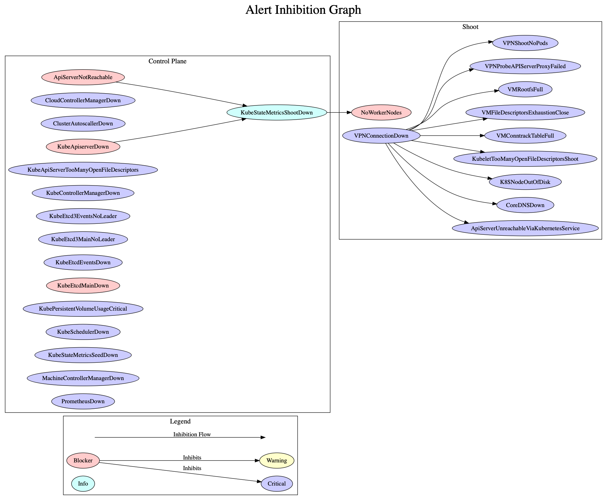

# Alerting

Gardener uses [Prometheus](https://prometheus.io/) to gather metrics from each component. A Prometheus is deployed in each shoot control plane (on the seed) which is responsible for gathering control plane and cluster metrics. Prometheus can be configured to fire alerts based on these metrics and send them to an [alertmanager](https://prometheus.io/docs/alerting/alertmanager/). The alertmanager is responsible for sending the alerts to users and operators. This document describes how to setup alerting for:

- [end-users/stakeholders/customers](#Alerting-for-Users)
- [operators/administrators](#Alerting-for-Operators)

# Alerting for Users

To receive email alerts as a user set the following values in the shoot spec:

```yaml
spec:
  monitoring:
    alerting:
      emailReceivers:
      - john.doe@example.com
```
`emailReceivers` is a list of emails that will receive alerts if something is wrong with the shoot cluster. A list of alerts for users can be found [here](user_alerts.md).

# Alerting for Operators

Currently, Gardener supports two options for alerting:

- [Email Alerting](#Email-Alerting)
- [Sending Alerts to an external alertmanager](#External-Alertmanager)

A list of operator alerts can be found [here](operator_alerts.md).

## Email Alerting

Gardener provides the option to deploy an alertmanager into each seed. This alertmanager is responsible for sending out alerts to operators for each shoot cluster in the seed. Only email alerts are supported by the alertmanager managed by Gardener. This is configurable by setting the Gardener controller manager configuration values `alerting`. See [this](../usage/configuration.md) on how to configure the Gardener's SMTP secret. If the values are set, a secret with the label `gardener.cloud/role: alerting` will be created in the garden namespace of the garden cluster. This secret will be used by each alertmanager in each seed.

## External Alertmanager

The alertmanager supports different kinds of [alerting configurations](https://prometheus.io/docs/alerting/configuration/). The alertmanager provided by Gardener only supports email alerts. If email is not sufficient, then alerts can be sent to an external alertmanager. Prometheus will send alerts to a URL and then alerts will be handled by the external alertmanager. This external alertmanager is operated and configured by the operator (i.e. Gardener does not configure or deploy this alertmanager). To configure sending alerts to an external alertmanager, create a secret in the virtual garden cluster in the garden namespace with the label: `gardener.cloud/role: alerting`. This secret needs to contain a URL to the external alertmanager and information regarding authentication. Supported authentication types are:

- No Authentication (none)
- Basic Authentication (basic)
- Mutual TLS (certificate)

### Remote Alertmanager Examples

Note: the `url` value cannot be prepended with `http` or `https`.

```yaml
# No Authentication
apiVersion: v1
kind: Secret
metadata:
  labels:
    gardener.cloud/role: alerting
  name: alerting-auth
  namespace: garden
data:
  # No Authentication
  auth_type: base64(none)
  url: base64(external.alertmanager.foo)

  # Basic Auth
  auth_type: base64(basic)
  url: base64(extenal.alertmanager.foo)
  username: base64(admin)
  password: base64(password)

  # Mutual TLS
  auth_type: base64(certificate)
  url: base64(external.alertmanager.foo)
  ca.crt: base64(ca)
  tls.crt: base64(certificate)
  tls.key: base64(key)
  insecure_skip_verify: base64(false)

  # Email Alerts (internal alertmanager)
  auth_type: base64(smtp)
  auth_identity: base64(internal.alertmanager.auth_identity)
  auth_password: base64(internal.alertmanager.auth_password)
  auth_username: base64(internal.alertmanager.auth_username)
  from: base64(internal.alertmanager.from)
  smarthost: base64(internal.alertmanager.smarthost)
  to: base64(internal.alertmanager.to)
type: Opaque
```

### Configuring your External Alertmanager

Please refer to the [alertmanager](https://prometheus.io/docs/alerting/alertmanager/) documentation on how to configure an alertmanager.

We recommend you use at least the following inhibition rules in your alertmanager configuration to prevent excessive alerts:
```yaml
inhibit_rules:
# Apply inhibition if the alert name is the same.
- source_match:
    severity: critical
  target_match:
    severity: warning
  equal: ['alertname', 'service', 'cluster']

# Stop all alerts for type=shoot if there are VPN problems.
- source_match:
    service: vpn
  target_match_re:
    type: shoot
  equal: ['type', 'cluster']

# Stop warning and critical alerts if there is a blocker
- source_match:
    severity: blocker
  target_match_re:
    severity: ^(critical|warning)$
  equal: ['cluster']

# If the API server is down inhibit no worker nodes alert. No worker nodes depends on kube-state-metrics which depends on the API server.
- source_match:
    service: kube-apiserver
  target_match_re:
    service: nodes
  equal: ['cluster']

# If API server is down inhibit kube-state-metrics alerts.
- source_match:
    service: kube-apiserver
  target_match_re:
    severity: info
  equal: ['cluster']

# No Worker nodes depends on kube-state-metrics. Inhibit no worker nodes if kube-state-metrics is down.
- source_match:
    service: kube-state-metrics-shoot
  target_match_re:
    service: nodes
  equal: ['cluster']
```
Below is a graph visualizing the inhibition rules:


